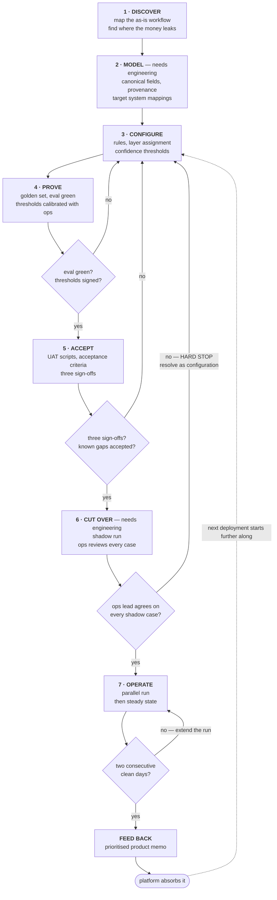

# Deployment package — bulk oilseed purchase reconciliation

A worked forward-deployment for a fictional commodity trader: discovery through go-live, on one
real workflow, with the rules engine and eval harness executable.

**This is a configuration and deployment artefact, not a product prototype.** A forward-deployed
engineer does not build the platform; they turn a customer's messy reality into a spec the
platform can run — data model, field mappings, business rules, the deterministic/agentic/human
split, acceptance criteria, and a runbook. That is what this is.

Built as an interview work sample. Every company, cargo, price and counterparty is fabricated.

```bash
git clone https://github.com/lucaschatham/commodityai-fde-work-sample
cd commodityai-fde-work-sample
./run.sh
```

Python 3.10+. No dependencies, no credentials, no network.

---

## The method this is a worked example of

Seven phases, four gates, one return arc.

Two things make it a method rather than a checklist. **It stops** — four gates can send a
deployment backwards, and one is a hard stop no schedule pressure overrides. And **it compounds** —
the output isn't just a live workflow, it's rules, golden cases and product feedback that make the
next deployment start further along. An implementation consultant finishes a project; a deployment
engineer leaves the next deployment shorter.



**Six of eight phases need no engineering time.** That's the design goal, not an accident of this
customer. The two that do are bounded and scheduled: integration credentials at Model, the
write-back flag at Cut over. If a deployment pulls engineers in anywhere else, the method has
failed, and that's worth saying out loud rather than absorbing quietly.

**G3 and G4 are the two people try to negotiate away** under schedule pressure, which is why
they're written down in advance. A cutover completed over an unresolved objection produces a system
nobody uses — the ops lead's disagreement is data about the configuration, not resistance to be
managed. And the parallel run exits on a *signal*, not a *date*.

Phase detail, artifacts and gate conditions: [00 — Deployment method](docs/00-deployment-method.md).

## The trade

60,000 MT Brazilian soyabeans in bulk, Paranaguá → Rotterdam, CIF, GAFTA 100, priced off CBOT
May-26 futures plus a USD 38.00/MT basis. Invoice value USD 27,193,101.25.

Seven source documents — broker confirmation email, sales contract, bill of lading, certificate of
quality, phytosanitary certificate, commercial invoice, and a WhatsApp broker thread.

The job: reconcile contract ↔ shipping documents ↔ invoice, and decide what a human needs to see.

## What it finds

| | |
|---|---|
| Rules evaluated | 16 |
| Exceptions | 9 (7 blocking) |
| **Confirmed recoverable** | **USD 95,175.85** |
| **Pending human review** | **USD 89,118.75** |
| Status | PAYMENT BLOCKED |

The headline exceptions: a contractual moisture allowance the seller acknowledged in chat and then
omitted from the invoice; an oil-content discount likewise omitted; an invoice raised on shipped
weight when the contract settles on outturn weight; a three-day late shipment; and a missing
outturn weight certificate.

Full report: [`docs/exception-report.md`](docs/exception-report.md).

## Eval

```
10/10 cases green across 56 assertions.

KNOWN GAPS (asserted, not fixed)
  - contractual claim deadlines: no rule covers this. Exposure USD 184,294.60.
```

Two things the golden set does deliberately.

**It keeps a fully conforming cargo in the suite.** A catalogue that only knows how to raise
exceptions gets muted by its users inside a month.

**It asserts a gap rather than omitting one.** The catalogue finds USD 184k of recoverable value
and attaches no deadline to it. GAFTA time-bars claims; a credit note that sits in a queue past
the bar is worth zero. The eval fails if a rule ever silently starts covering it, so the gap
cannot quietly disappear — and it is item 1 in the product feedback memo.

[`evals/RESULTS.md`](evals/RESULTS.md)

## The one that isn't automatable

The bill of lading is dated 3 March against a window closing 28 February. The cargo is late and the
contract is breached on its face. The broker chat contains a clear extension request, a clear "ok
fine, noted", and a broker acknowledgement.

The model reads all of that correctly. The rule still routes to a human, at any confidence, and
there is an eval case pinning it that way even when the acknowledgement comes from the contract
signatory.

The question is not *what was said*. It is *was the person who said it empowered to bind the
company, in the form the contract requires* — and that is a fact about the customer's org chart,
not about the document. Chase extraction accuracy from 0.94 to 0.97 and the queue barely moves.
Model delegated authority once and a whole class of exceptions closes.

That is the deployment finding, and it is [item 2 in the feedback memo](docs/06-product-feedback-memo.md).

---

## Contents

| | |
|---|---|
| [00 — Deployment method](docs/00-deployment-method.md) | The seven phases, four gates, and the return arc. What each phase leaves behind and which need an engineer |
| [01 — Discovery & workflow map](docs/01-discovery-workflow-map.md) | As-is process, where the money leaks, and a reusable 22-question discovery bank |
| [02 — Data model & field mappings](docs/02-field-mappings.md) | Source doc → canonical field → NetSuite, with confidence and provenance |
| [03 — Rules & review policy](docs/03-rules-and-review-policy.md) | The deterministic / model-assisted / human-authority split, and confidence gating |
| [04 — UAT & acceptance](docs/04-uat-acceptance.md) | Acceptance criteria, eight test scripts, defect triage |
| [05 — Go-live runbook](docs/05-golive-runbook.md) | Cutover, parallel run, steady-state monitoring, rollback |
| [06 — Product feedback memo](docs/06-product-feedback-memo.md) | Five items for engineering, prioritised, with what I'd want challenged |

**Code**

| | |
|---|---|
| [`src/schema.py`](src/schema.py) | Canonical model. Every field carries confidence and a source span. |
| [`src/extract.py`](src/extract.py) | Extraction behind an interface — fixtures by default, Claude adapter if a key is present |
| [`src/rules.py`](src/rules.py) | The 16 rules. This is the actual deliverable. |
| [`src/reconcile.py`](src/reconcile.py) | Three-way match orchestration |
| [`src/report.py`](src/report.py) | Exception report, ordered by what stops the money |
| [`evals/run_eval.py`](evals/run_eval.py) | Golden-set harness |
| [`data/synthetic/`](data/synthetic/) | The seven fabricated source documents |

## Three design decisions

**1. Deterministic by default.** Fourteen of sixteen rules never touch a model at decision time. A
model extracts `14.35` from a certificate; whether 14.35 exceeds 14.00 is not a judgement call.
Deterministic rules are testable, explainable to a counterparty, and stable across model versions —
and when a USD 95k claim is read aloud by someone else's lawyer, the arithmetic has to survive it.

**2. A verdict is capped by its worst input.** Rules declare their inputs; the engine takes the
minimum confidence and withholds the verdict below threshold, preserving what the rule *would* have
said. Failures are gated as hard as passes: rejecting a USD 27m invoice on a digit you are not sure
you read is worse than a five-minute review. One 0.86 extraction correctly quarantines every
downstream conclusion, which is why confirmed and pending money are reported separately.

**3. A rule that errors is never a rule that passed.** An unevaluated rule returns `NEEDS_REVIEW`
naming the exception. The failure this prevents is the expensive one — a rule quietly stops firing
after a schema change and nobody notices for a quarter, because the queue got *shorter*.

## What's honest about the seam

Extraction is behind an interface with two implementations. The default replays a committed golden
extraction: no key, no network, deterministic, so anyone can clone and run this in one command. A
Claude adapter regenerates fixtures when `ANTHROPIC_API_KEY` is set.

That seam is a deployment decision, not a shortcut. Evaluating extraction and rules together means
a rules regression and a model regression look identical in the results. Separating them means a
red eval points at exactly one owner — the deployment engineer, or the platform team. That is the
difference between a useful bug report and a vague one.

---

*Fictional customer, fabricated documents, invented prices. Trade structure, contract terms,
quality parameters and conversion factors follow standard bulk oilseed practice.*
