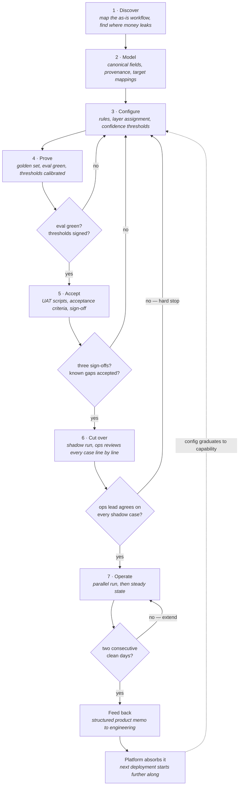

# 00 — Deployment method

The sequence this package is a worked example of. Seven phases, four gates, one return arc.

Two things make it a method rather than a checklist:

**It stops.** Four gates can send a deployment backwards, and one of them is a hard stop that no
schedule pressure overrides. A pipeline that only moves forward isn't a process, it's a hope.

**It compounds.** The output of a deployment is not just a live workflow — it's rules, golden
cases, and product feedback that make the next one start further along. An implementation
consultant finishes a project. A deployment engineer leaves the next deployment shorter.

## The phases, and what each one leaves behind

| # | Phase | Produces | Needs an engineer? |
|---|---|---|---|
| 1 | **Discover** | Workflow map, quantified leak points, question bank → [01](01-discovery-workflow-map.md) | No |
| 2 | **Model** | Canonical schema, field mappings, write-back policy → [02](02-field-mappings.md) | Yes — integration credentials and scope |
| 3 | **Configure** | Rule catalogue, layer assignment, thresholds → [03](03-rules-and-review-policy.md) | No |
| 4 | **Prove** | Golden set, eval results, asserted known gaps → [evals/](../evals/) | No |
| 5 | **Accept** | Acceptance criteria, test scripts, sign-offs → [04](04-uat-acceptance.md) | No |
| 6 | **Cut over** | Runbook, shadow-run evidence, rehearsed rollback → [05](05-golive-runbook.md) | Yes — enabling write-back |
| 7 | **Operate** | Monitoring cadence, queue-decay trend | No |
| — | **Feed back** | Prioritised product memo → [06](06-product-feedback-memo.md) | Receives it |

**Six of eight phases need no engineering time.** That is the design goal, not an accident of this
particular customer. The two that do are bounded and scheduled: credentials at Model, the write-back
flag at Cut over. If a deployment is pulling engineers in anywhere else, the method has failed and
that is worth saying out loud rather than absorbing quietly.

## The four gates

| Gate | Condition | On failure |
|---|---|---|
| **G1** after Prove | Eval green; thresholds chosen and signed by the ops lead | Back to Configure |
| **G2** after Accept | Three sign-offs; P1s closed; known gaps accepted in writing | Back to Configure |
| **G3** at Cut over | Ops lead agrees with the system on **every** shadow case | **Hard stop.** Resolve as a configuration change, not a conversation |
| **G4** in Operate | Two consecutive days with zero P1/P2 defects | Extend the parallel run |

G3 and G4 are the two people try to negotiate away under schedule pressure, so they are written
down in advance.

- **G3** exists because a cutover completed over an unresolved objection produces a system nobody
  uses. The ops lead's disagreement is data about the configuration, not resistance to be managed.
- **G4** exits on a *signal*, not a *date*. If day ten arrives without two clean days, the parallel
  run extends and somebody's plan slips. That is the correct outcome, and agreeing it up front means
  it isn't a negotiation in the moment.

## Where the leverage is

Phases 1 and 3 are where a deployment is won or lost, and they are the two most often rushed.

Discovery decides which workflow gets automated at all — pick a workflow with no financial readout
and the deployment can succeed technically and still fail to be worth renewing. Configuration
decides what the system is allowed to conclude on its own, which is the difference between a queue
ops trusts and a queue ops mutes.

Everything downstream of those two is execution. Important, and recoverable. Getting phase 1 or 3
wrong is not.
