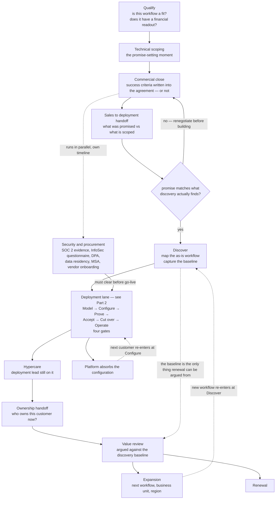
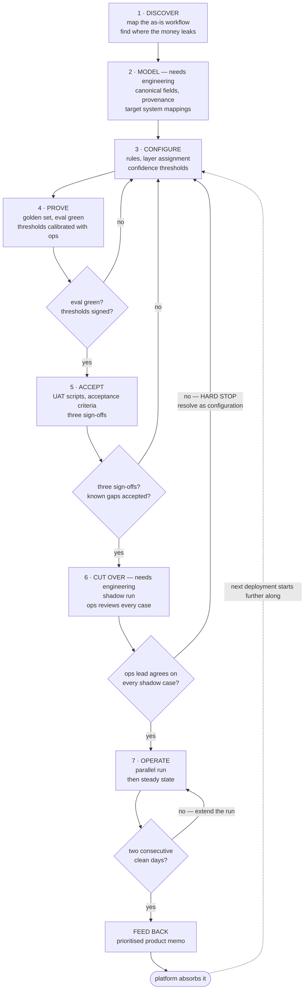

# 00 — Deployment method

Two views. The wider arc a customer travels from first call to renewal, and the deployment lane
inside it that this package is a worked example of.

---

# Part 1 — Where deployment sits in the wider arc

Deployment is the middle third. Most of what determines whether it succeeds happens before it
starts, and most of what determines whether it *mattered* happens after it ends.

## Three things this view makes visible that a phase list doesn't

**The baseline is a commercial instrument, not a discovery artifact.** The long dotted line from
Discover to Value review is the most consequential edge on the diagram. If nobody measured touch
time, error rate and leaked value *before* the system went in, then at renewal there is no
argument — only anecdote and whoever is most senior in the room. That measurement costs an
afternoon during discovery and is unrecoverable afterwards.

**Security and procurement is a parallel track with its own clock.** At Cargill scale it can run
months and it blocks go-live independently of whether the deployment work is finished. Treating it
as a downstream step is how a deployment that was technically ready in six weeks goes live in five
months.

**The two return loops re-enter at different points.** Platform absorption shortens the *next
customer* by re-entering at Configure. Expansion within an existing customer re-enters at Discover,
because it is a new workflow with its own as-is map and its own baseline. Conflating them is how an
expansion gets scoped as a configuration change and then runs over.

## Who owns what — my working assumption

Stated so it can be corrected. This is the part I would most expect to have wrong.

| Stage | My assumption | Where I'd expect to be |
|---|---|---|
| Qualify | Founder or AE | Not involved |
| Technical scoping | **Shared** | In the room. This is where deliverability gets promised |
| Commercial close | Founder or AE | Supplying what is technically committable |
| Security and procurement | Eng or ops leadership | Supplying evidence, not driving |
| Handoff and reconciliation | **Deployment owns** | Owning it |
| Discover → Operate | **Deployment owns** | Owning it |
| Hypercare | **Deployment owns** | Owning it |
| Ownership handoff | Unclear at this size | ? |
| Value review | **Shared** | Owning the evidence |
| Expansion | AE or founder | Sourcing the signal from inside the account |
| Renewal | Founder or AE | Supplying the evidence |

## What I don't know yet

The honest gaps. Each changes how the role should actually be run:

1. **Is there a pilot or POC stage before a full deployment?** A paid pilot with its own success
   criteria is a different animal from going straight to production, and it changes what gets
   promised at scoping.
2. **Does deployment sit in pre-sales technical scoping?** If not, the reconciliation gate after
   handoff is doing much more work and will be adversarial rather than administrative.
3. **Who owns the customer after hypercare?** At ten people this is often nobody, which means it
   is still the deployment lead, which means deployment capacity silently becomes support capacity.
4. **Who drives security and procurement?** It is the single most common cause of a go-live date
   slipping for reasons unrelated to the deployment.
5. **Does deployment carry an expansion number?** It changes whether you optimise for the workflow
   in front of you or for the second one.
6. **What is measured at renewal, and who agreed to it?** If the answer is decided after go-live,
   the baseline was probably never captured.

---

# Part 2 — The deployment lane

Seven phases, four gates, one return arc.

Two things make it a method rather than a checklist. **It stops** — four gates can send a deployment
backwards, and one is a hard stop no schedule pressure overrides. And **it compounds** — the output
isn't just a live workflow, it's rules, golden cases and product feedback that make the next
deployment start further along. An implementation consultant finishes a project; a deployment
engineer leaves the next deployment shorter.

## The phases, and what each one leaves behind

| # | Phase | Produces | Needs an engineer? |
|---|---|---|---|
| 1 | **Discover** | Workflow map, quantified leak points, baseline, question bank → [01](01-discovery-workflow-map.md) | No |
| 2 | **Model** | Canonical schema, field mappings, write-back policy → [02](02-field-mappings.md) | Yes — integration credentials and scope |
| 3 | **Configure** | Rule catalogue, layer assignment, thresholds → [03](03-rules-and-review-policy.md) | No |
| 4 | **Prove** | Golden set, eval results, asserted known gaps → [evals/](../evals/) | No |
| 5 | **Accept** | Acceptance criteria, test scripts, sign-offs → [04](04-uat-acceptance.md) | No |
| 6 | **Cut over** | Runbook, shadow-run evidence, rehearsed rollback → [05](05-golive-runbook.md) | Yes — enabling write-back |
| 7 | **Operate** | Monitoring cadence, queue-decay trend | No |
| — | **Feed back** | Prioritised product memo → [06](06-product-feedback-memo.md) | Receives it |

**Six of eight phases need no engineering time.** That is the design goal, not an accident of this
particular customer. The two that do are bounded and scheduled: credentials at Model, the write-back
flag at Cut over. If a deployment is pulling engineers in anywhere else, the method has failed and
that is worth saying out loud rather than absorbing quietly.

## The four gates

| Gate | Condition | On failure |
|---|---|---|
| **G1** after Prove | Eval green; thresholds chosen and signed by the ops lead | Back to Configure |
| **G2** after Accept | Three sign-offs; P1s closed; known gaps accepted in writing | Back to Configure |
| **G3** at Cut over | Ops lead agrees with the system on **every** shadow case | **Hard stop.** Resolve as a configuration change, not a conversation |
| **G4** in Operate | Two consecutive days with zero P1/P2 defects | Extend the parallel run |

G3 and G4 are the two people try to negotiate away under schedule pressure, so they are written
down in advance.

- **G3** exists because a cutover completed over an unresolved objection produces a system nobody
  uses. The ops lead's disagreement is data about the configuration, not resistance to be managed.
- **G4** exits on a *signal*, not a *date*. If day ten arrives without two clean days, the parallel
  run extends and somebody's plan slips. That is the correct outcome, and agreeing it up front means
  it isn't a negotiation in the moment.

## Where the leverage is

Phases 1 and 3 are where a deployment is won or lost, and they are the two most often rushed.

Discovery decides which workflow gets automated at all — pick a workflow with no financial readout
and the deployment can succeed technically and still fail to be worth renewing. Configuration
decides what the system is allowed to conclude on its own, which is the difference between a queue
ops trusts and a queue ops mutes.

Everything downstream of those two is execution. Important, and recoverable. Getting phase 1 or 3
wrong is not.
